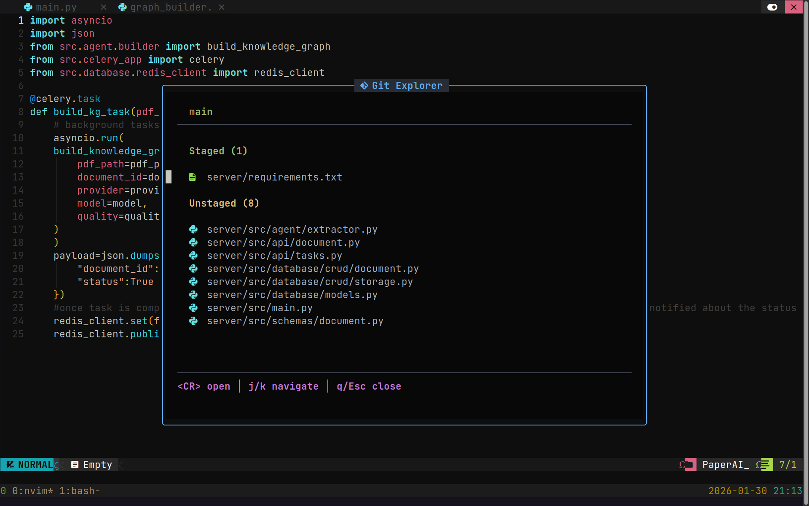

# git-explorer.nvim

A simple Neovim floating Git Explorer modal.




## Features
- Shows Staged / Unstaged / Untracked files
- Git status icons per section
- File type icons for files
- Open file by pressing `<CR>`
- Toggle modal with `<leader>ge`

## Installation

### Using lazy.nvim
```lua
  {
 "prasannashrestha011/git-explorer.nvim",
    config = function()
        -- optional: define a keymap to toggle it
        vim.keymap.set("n", "<leader>ge", "", {
            noremap = true,
            silent = true,
            callback = function()
                require("git_explorer").open()
            end,
        })
    end,
  }
  ```
